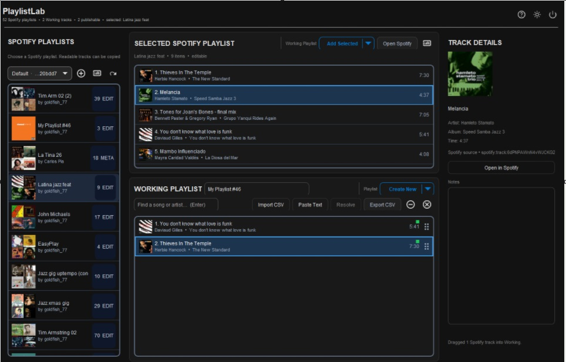

# PlaylistLab

PlaylistLab is a U++ desktop application for turning Spotify playlists, Spotify search results, pasted song lists, and CSV files into one ordered **Working Playlist** that can be reviewed before anything is written back to Spotify.



The interface deliberately keeps the model small:

1. **Selected Spotify Playlist** — the Spotify playlist you are viewing. Readability is verified by the actual Spotify item request and is kept separate from editability.
2. **Working Playlist** — the local authored playlist. This is the only list PlaylistLab publishes back to Spotify.

Tracks can be copied or dragged from Spotify into Working. **Find**, CSV import and pasted text also feed Working directly. Imported text stays unresolved until **Resolve** is requested; ambiguous candidates remain visible for review rather than quietly becoming somebody else's song.

Working supports multi-selection, Delete/remove, CSV export, right-grip reorder, an editable playlist name, artwork, locally persisted per-track notes and a Track Details inspector. Selecting a track in either Spotify or Working updates the inspector.

## Spotify destination actions

Spotify writes are separate explicit operations and always show an exact preview first. The preview is the confirmation; **Cancel** performs no write.

- **Create New** — create a new private Spotify playlist from exact publishable Working order.
- **Append Missing** — occurrence-aware append only. Missing Working occurrences are added at the end; existing Spotify items are not reordered or deleted.
- **Replace** — explicitly destructive. Replace the selected editable Spotify playlist with exact Working order.

Append and Replace re-read the target and snapshot before writing, surface stale/partial outcomes, and verify the final remote sequence before reporting success. No mutation path silently retries, replans, deletes or rolls back behind the preview.

The older deterministic add/reorder planner remains core-tested infrastructure, but it is no longer the primary workspace action.

## Spotify setup

PlaylistLab uses Spotify's Web API and PKCE authorization. It never asks for or stores a Client Secret.

Spotify's current Development Mode requires the app owner to have an active **Spotify Premium** subscription. In PlaylistLab, press the **Help (?)** button for the complete setup guide, or see [`docs/SPOTIFY_SETUP.md`](docs/SPOTIFY_SETUP.md).

The short version is:

1. Sign in to Spotify in your normal browser.
2. Open the [Spotify Developer Dashboard](https://developer.spotify.com/dashboard).
3. Create/open your PlaylistLab developer app.
4. Register `http://127.0.0.1:43821/callback` as the redirect URI.
5. Copy the app's **Client ID** from its Basic Information page.
6. Add that Client ID as a friendly named profile in PlaylistLab and authorize when prompted.

The Client ID itself does not expire?. Spotify's current user refresh tokens have a roughly six-month / 180-day lifetime, so periodic browser reauthorization is expected.

## Repository layout

- `PlaylistLab/` — U++ GUI application and playlist/Spotify implementation.
- `tests/PlaylistCoreTest/` — deterministic non-network core tests.
- `examples/` — sample import files.
- `docs/` — design notes, Spotify setup, project status and `ACTIVE_WORK.md` recovery state.

## Dependencies

- U++ Core/CtrlLib
- U++ `Ui` package from [`Trilec/upp_Ui`](https://github.com/Trilec/upp_Ui)
- Spotify Developer application for live Spotify workflows

The production package uses `GUI MT`. Windows validation convention keeps the final executable directly at:

```text
E:\apps\github\upp_playlistlab\build\PlaylistLab.exe
```
